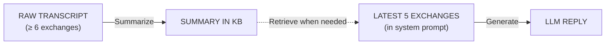

# LightRAG – Handling Discourse

Todd (our chatbot) has to remember a lot, but prompts have token limits. The cure is simple: **summarize the old stuff, keep the fresh stuff.** The diagram below shows the whole pipeline at a glance, followed by the real data that moves through each stage.

---

## 1 · Big-Picture Flow



* **Raw transcript** = everything older than the 5 most-recent exchanges.
* **Summary in KB** = compressed version that RAG can fetch later.
* **Prompt chunk** = newest 5 exchanges pasted verbatim.

---

## 2 · Using a Script from The Foreigner by Larry Shue

### 2.1 RAW TRANSCRIPT (first 3 of 10 exchanges)

```text
Betty: Hi, Todd! I want to give you a hug but I am all wet from the rain!
Todd: Oh, I’ve been wet before! Reminds me of Malaysia.

Betty: Who’s she?
Todd: No, it’s a place. Oh, here, look. I brought you something.

Betty: What?
Todd: Spoons! For your collection!
… (continues for 7 more exchanges)
```

### 2.2 SUMMARY IN KB

```text
Betty greets Todd (soaked from rain). Todd jokes about Malaysia and gifts her travel spoons. Conversation turns serious: Betty’s B&B is cash-strapped after winter-storm damage. Property-inspector Owen Musser claims her foundation is rotten and may condemn the place. Todd asks about repairs; Betty points to new bricks outside.
```

### 2.3 PROMPT CHUNK (latest **5 exchanges**)

```text
Betty: You see that pile of new bricks outside?
Todd: In the parking lot?
Betty: Yeah. I went and bought them to fix the foundation, but getting bricklayers at twenty dollars an hour is too much for me. I can’t afford that. Not unless I get some business in here. Anyway, how are you?
Todd: Oh, I’m all right. I’m here to be a guest instructor for the army again. I’ll take a few young recruits out and tell them stories about the bomb squad, then we blow up a mountain. Not a bad duty!
Betty: Isn’t that dangerous?
Todd: No! We’re miles away when it goes off.
Betty: Oh, I’m all right. I’m here to be a guest instructor for the army again. I’ll take a few young recruits out and tell them stories about the bomb squad, then we blow up a mountain. Not a bad duty!
Todd: Can I get you a drink?
Betty: I’d love one. Do you have any beer?
Todd: Sure. Oh my goodness! Look at these apples right on the top shelf of the fridge. Two of them this time! Every day this boy Ellard Simms takes one bite out of an apple then decides he doesn’t want it and dumps it somewhere. It drives me crazy. Scolding him doesn’t help. Reverend David says I just ought to forgive him, but then he’s the sweetest tempered person I’ve ever met.
```

---

## 3 · Does Retrieval Really Work?

```shell
You: where are the new bricks?
Todd: The new bricks are right outside in the parking lot!

You: what does Betty like?
Todd: Betty loves my travel stories and the spoons I give her.
```

Both answers come from the **KB summary**, not the prompt chunk, proof that RAG fetches the older context when needed.

---
