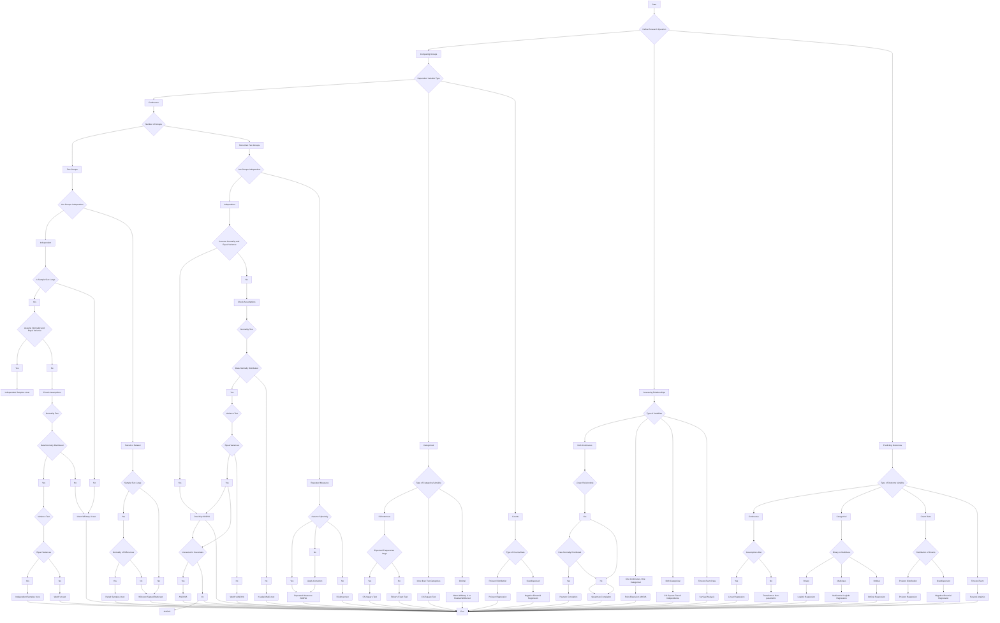

# Statistics

### Definitions

| Term                           | Definition                                                                                   | Indicators/Tests                                                                                 | Expected Values/Good Values                                        |
|--------------------------------|-----------------------------------------------------------------------------------------------|--------------------------------------------------------------------------------------------------|---------------------------------------------------------------------|
| Normality                      | Data follows a normal (Gaussian) distribution.                                                | Shapiro-Wilk Test, Kolmogorov-Smirnov Test, Q-Q Plots, Histograms                               | p > 0.05 in tests indicates normality                              |
| Homogeneity of Variance        | Variances are equal across groups or samples.                                                | Levene's Test, Bartlett's Test                                                                   | p > 0.05 in tests indicates equal variances                        |
| Independence of Observations   | Observations are not related to each other.                                                  | Study Design Considerations                                                                      | Ensured through proper randomization                               |
| Sphericity                     | Variance of differences between all combinations of related groups are equal (for repeated measures ANOVA). | Mauchly's Test of Sphericity                                                                     | p > 0.05 indicates sphericity assumption is met                    |
| Covariance                     | Measures how much two random variables vary together.                                        | ANCOVA (Analysis of Covariance)                                                                  | Adjusts for effects of covariates                                  |
| Sample Size Adequate           | Sufficient number of observations to meet the assumptions of statistical tests.              | Central Limit Theorem (n ≥ 30), Power Analysis                                                  | Larger sample sizes increase test power                            |
| Parametric Tests               | Statistical tests that assume data follows a certain distribution (usually normal distribution). | t-tests, ANOVA, Pearson Correlation, Linear Regression                                           | Assumptions must be met                                            |
| Non-parametric Tests           | Statistical tests that do not assume a specific distribution.                                | Mann-Whitney U, Wilcoxon Signed-Rank, Kruskal-Wallis, Spearman Correlation                      | Used when assumptions of parametric tests are violated             |
| Within-Subjects Design         | Same subjects are measured under different conditions (repeated measures).                  | Repeated Measures ANOVA, Paired t-test                                                           | Controls for individual differences                                |
| Between-Subjects Design        | Different subjects are used in each condition or group.                                     | Independent Samples t-test, One-Way ANOVA                                                        | Groups must be comparable                                          |
| Covariates                     | Variables that are possibly predictive of the outcome and are controlled for in the analysis. | ANCOVA, Regression Models                                                                        | Improves accuracy by accounting for variance due to covariates     |
| Overdispersion                 | Variance exceeds the mean in count data (common in Poisson models).                         | Check dispersion parameter in Poisson Regression                                                 | If overdispersion exists, use Negative Binomial Regression         |
| Time-to-Event Data             | Data that measures the time until an event occurs.                                          | Survival Analysis, Kaplan-Meier Curves, Cox Proportional Hazards Model                           | Censoring needs to be considered                                   |
| Assumptions Met                | Requirements for statistical tests are satisfied (e.g., normality, homoscedasticity, linearity). | Residual Plots, Statistical Tests                                                                | Ensures validity of test results                                   |
| Correlation Coefficient (r)    | Measures the strength and direction of a linear relationship between two variables.         | Pearson or Spearman Correlation                                                                  | Values range from -1 to 1; values close to -1 or 1 indicate strong correlation |
| p-value                        | Probability of observing the data, or something more extreme, if the null hypothesis is true. | Output from statistical tests                                                                    | p < 0.05 typically considered statistically significant            |
| Effect Size                    | Magnitude of the difference or relationship, independent of sample size.                    | Cohen's d, Eta-squared (η²), Odds Ratio                                                          | Larger values indicate stronger effects                            |
| Power Analysis                 | Determines the sample size needed to detect an effect of a given size with a given degree of confidence. | Calculated using effect size, significance level, and desired power                              | Power (1 - β) typically set at 0.80 or higher                      |
| Multicollinearity              | Occurs when independent variables in a regression model are highly correlated.              | Variance Inflation Factor (VIF)                                                                  | VIF > 5 or 10 indicates multicollinearity                          |
| Residuals                      | Difference between observed and predicted values in a regression model.                     | Residual Plots, Normality Tests                                                                  | Should be randomly distributed, normally distributed for linear regression |
| Logistic Regression            | Regression analysis used when the dependent variable is categorical (binary or multinomial). | Output includes Odds Ratios, p-values                                                            | Assumes linearity in the logit for continuous predictors           |
| ANCOVA                         | Combines ANOVA and regression to adjust for the effects of covariates.                      | Adjusts the means of dependent variable across groups based on covariates                        | Assumes homogeneity of regression slopes                           |
| Cox Proportional Hazards Model | A regression model commonly used in survival analysis.                                      | Estimates hazard ratios                                                                          | Assumes proportional hazards over time                             |
| Transformation                 | Applying a mathematical function to data to meet assumptions (e.g., log transformation).    | Log, Square Root, Box-Cox Transformations                                                        | Used to stabilize variance and normalize data                      |
